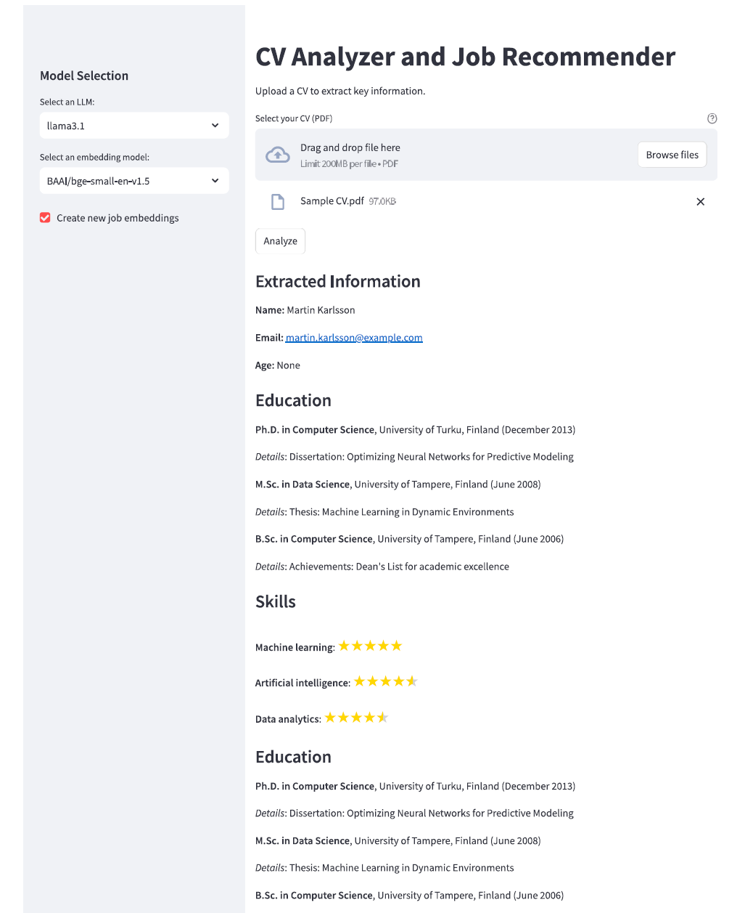
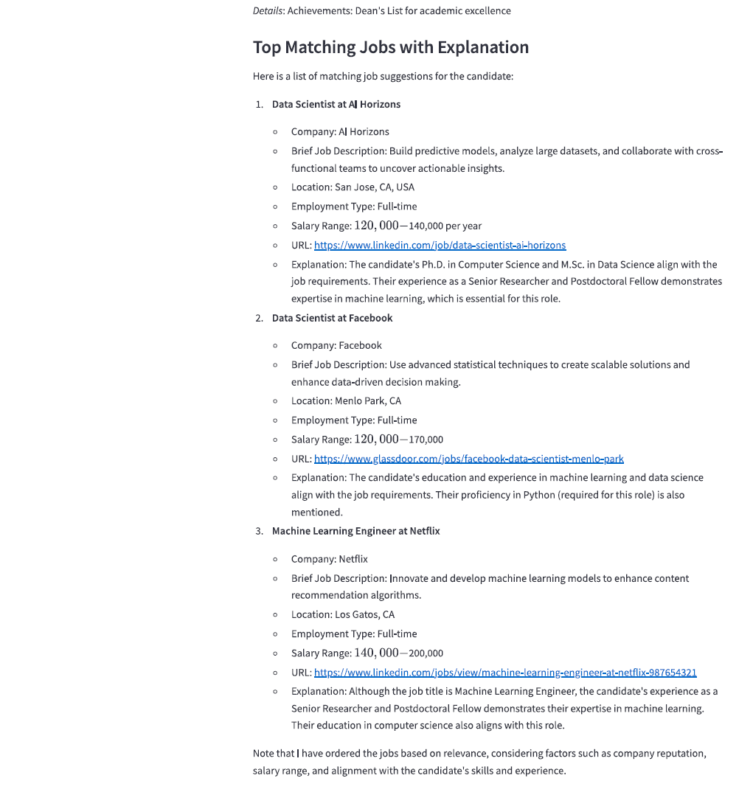

# Multimodal Contextual RAG for Information Extraction and Job Recommendation  

This project develops a **Retrieval-Augmented Generation (RAG)** system that combines **LlamaParse**, **Pydantic**, and multiple LLMs to build a job recommendation application. It leverages multimodal data, such as CVs and curated job advertisements, to extract meaningful insights, match candidates to roles, and generate personalized job recommendations with detailed explanations.  

---

## Key Features  

1. **Information Extraction**:
   - Utilizes **LlamaParse** and **Pydantic models** to extract structured information from unstructured documents like CVs.  
   - Extracts key attributes such as **educational credentials**, **skills**, and **professional experience**.  

2. **Semantic Skill Scoring**:
   - Scores extracted skills based on their **semantic strength** and relevance within the CV.  

3. **Job Vector Database**:
   - Creates a vectorized database of job advertisements using a curated list.  
   - Supports semantic similarity matching between job postings and candidate profiles.  

4. **RAG Pipeline**:
   - Retrieves top-matching jobs from the vector database based on semantic similarity.  
   - Generates final job recommendations using an LLM with detailed explanations for each suggestion.  

5. **Streamlit Application**:
   - Interactive interface for users to upload CVs and get job recommendations.  
   - Supports multiple LLMs and embedding models, including **OpenAI** and open-source options.  

---

## Technologies Used  

- **LlamaParse**: For extracting structured data from documents.  
- **Pydantic**: For creating and validating data models.  
- **OpenAI Models**: Advanced LLMs for contextual understanding and job recommendation generation.  
- **Open-Source LLMs**: To provide flexibility and cost-effective alternatives.  
- **Streamlit**: For building the user interface.  
- **Vector Databases**: For efficient semantic similarity search.  

---

## Project Workflow  

1. **CV Parsing**: Extract structured information using **LlamaParse**.  
2. **Skill Scoring**: Assign semantic scores to skills based on relevance and strength.  
3. **Job Database Creation**: Generate vector embeddings for curated job ads and store them in a database.  
4. **Job Matching**: Use semantic similarity to retrieve top-matching jobs from the database.  
5. **Recommendation Generation**: Use LLMs to generate personalized job recommendations with detailed explanations.  
6. **User Interaction**: Allow users to interact with the system via a Streamlit-based application.  

---

## Output Preview  

Here is a sample output from the application:  

*The above image shows the user interface with a sample CV uploaded, job matching results, and job recommendations displayed.*
